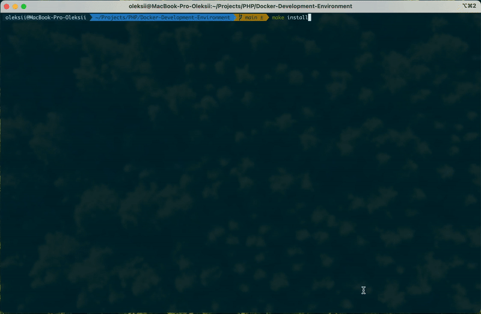
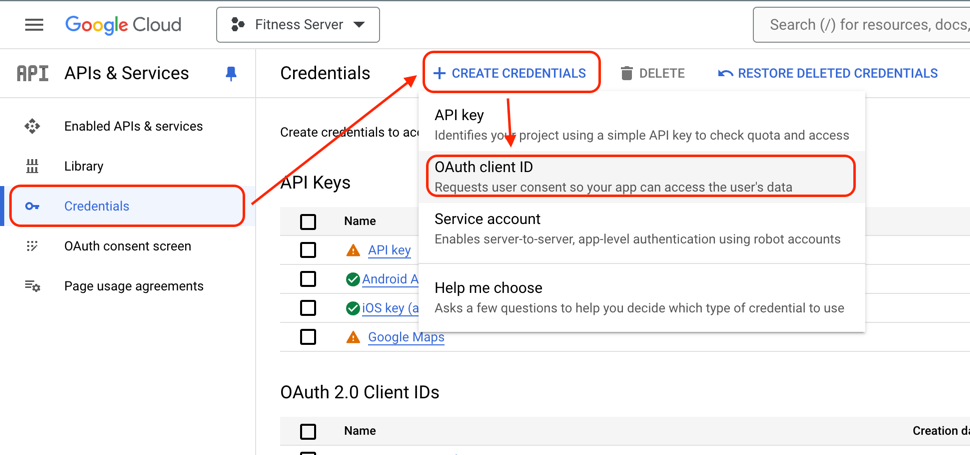
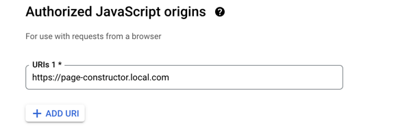
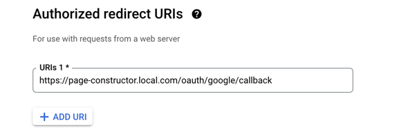

# Page Constructor

<h3 align="center">With PHP 8.1 and Laravel 8.0</h3>

<p align="center">

<a href="https://app.codacy.com/gh/OleksiiPopovDev/Page-Constructor/dashboard?utm_source=gh&utm_medium=referral&utm_content=&utm_campaign=Badge_grade"></a>


</p>
<p align="center">

</p>

## Installation
 * Pull **Docker-Development-Environment** project
```shell
git clone https://github.com/OleksiiPopovDev/Docker-Development-Environment.git
```
```shell
cd Docker-Development-Environment
```
 * Add Repository and Language of **Page Constructor** to _.repository_ file of **Docker-Development-Environment**
```shell
 echo "\n[PHP]https://github.com/PopovAleksey/Page-Constructor.git" >> .repositories
```
 * Add record to **/etc/hosts**
```
127.0.0.48	page-constructor.local.com
```
 * Run Installation script
```shell
make install
```
 * Choose number of **Page Constructor** project and press **Enter**

### Configuration Google oAuth
 * Go to https://console.cloud.google.com/
 * Open APIs & Services -> Credentials -> Create Credentials -> OAuth Client ID

 * Setup Authorized JavaScript origins as ```https://page-constructor.local.com```

 * Setup Authorized redirect URIs as ```https://page-constructor.local.com/oauth/google/callback```

 * Save changes
 * Download **Client Secret JSON** on same page and save it in **/storage** folder of project
 * Add path to **Client Secret JSON** file in .env ```OAUTH_GOOGLE_CONFIG_FILE```
```dotenv
OAUTH_GOOGLE_CONFIG_FILE=google_client_secret.json
```
 * Open https://page-constructor.local.com/login and Sign In via Google Account
 * Open https://page-constructor.local.com/constructor/languages for starting configure your Web page.
